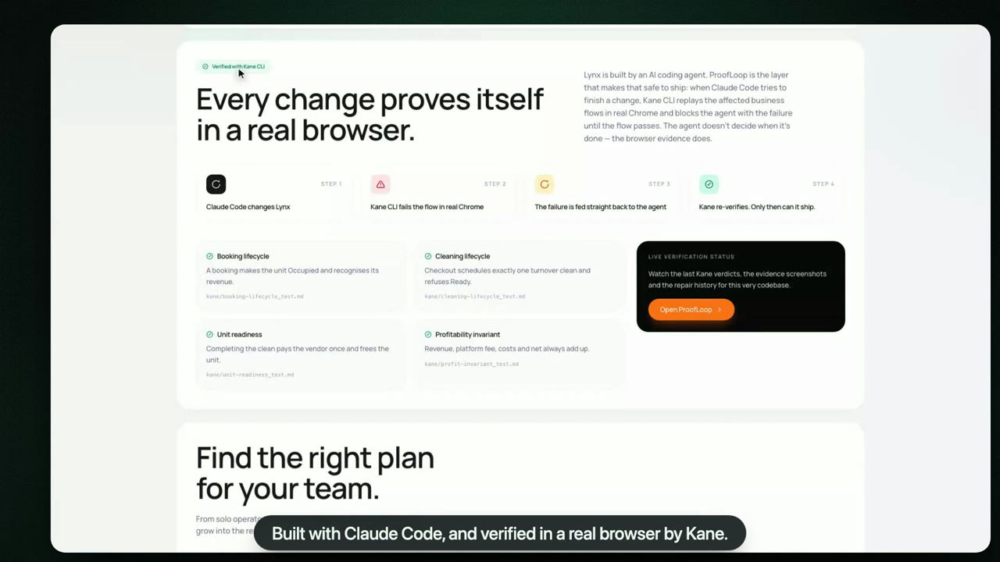
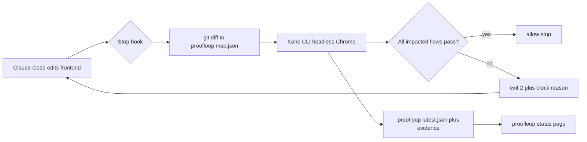

<div align="center">



&nbsp;

[](https://github.com/damishafe/Lynx/actions/workflows/verify.yml)
[](LICENSE)


[](https://lynx-kane.vercel.app/)

### The agent doesn't decide when it's done. Kane CLI does — in real Chrome, against business flows written as plain English.

Lynx is a multi-unit operations dashboard for short-term rental operators. **ProofLoop** is the
verification layer that makes building it with Claude Code safe to ship: on every attempted stop,
a hook maps the git diff to the business flows it could break, replays the matching
`kane/*_test.md` specs in headless Chrome, and **blocks the agent** with Kane's failure report
until every impacted flow passes — not when the model says it is done.

**[ Live app ↗ ](https://lynx-kane.vercel.app/)** &nbsp;·&nbsp; **[ Judge it in 90 seconds ↗ ](#judge-lynx-in-90-seconds)** &nbsp;·&nbsp; **[ Demo ↗ ](#-demo)** &nbsp;·&nbsp; **[ How ProofLoop decides ↗ ](#how-proofloop-decides)** &nbsp;·&nbsp; **[ Install in your repo ↗ ](#use-it-in-any-repo)**

</div>

---

## ▶ Demo

https://github.com/user-attachments/assets/59c65ff4-8810-49c5-84ea-f4b8eeeb9125

**[Download `lynx-proofloop-demo.mp4` (110s, 15 MB)](video/out/lynx-proofloop-demo.mp4)**

Every frame is the real console driving the real app — no mockups, no reconstructed agent output.
It walks one regression end to end: a $1,000 booking and turnover clean, a broken ledger
(`Costs $240.00` vs expected `$120.00`), Kane blocking Claude Code's stop with the real
`run_end` reason, the agent's fix, and a live re-verification that passes all eight profit steps
before the stop is allowed.

```
Same coding agent. Same app. Same four business flows.
Only the browser evidence decides when the change ships.
```

---

## Judge Lynx in 90 seconds

**Live console: [lynx-kane.vercel.app](https://lynx-kane.vercel.app/)** — frontend on Vercel,
MongoDB Atlas for auth and data, and a shipped ProofLoop snapshot on `/proofloop`. Click
**Launch Demo** on the landing page or go straight to
[`/demo`](https://lynx-kane.vercel.app/demo) → **Reset & launch demo** to run the product loop
without a local setup.

Everything also runs locally in four commands — Kane CLI replays the four business flows in
headless Chrome against your own dev server.

Four numbers, all reproducible from this repository:

| | |
|---|---|
| **4 / 4** | business flows Kane must hold on every full verify — booking, cleaning, readiness, profit |
| **25** | browser steps across the four `kane/*_test.md` contracts (6 + 5 + 8 + 6) |
| **0 credits** | on replay after the first authoring run — committed `kane/output-*/` recordings replay for free |
| **exit 2** | Stop hook blocks Claude Code with Kane's structured failure until the flow passes (max 3 attempts) |

```bash
cd frontend && cp .env.example .env.local   # paste MONGODB_URI
npm install && npm run dev                  # http://localhost:3000

npm i -g @testmuai/kane-cli && kane-cli login
node proofloop/src/cli.ts verify --all      # expect: VERIFIED — 4/4 flows, exit 0
open http://localhost:3000/proofloop        # same verdict as a live status page
open http://localhost:3000/demo             # Reset & launch demo → run the flows yourself
```

On production: [`/demo`](https://lynx-kane.vercel.app/demo) seeds three units and two vendors
with one click; [`/proofloop`](https://lynx-kane.vercel.app/proofloop) shows flows verified,
repair iterations, and Kane evidence from the last shipped verify run.

---

## Table of contents

- [The problem I set out to solve](#the-problem-i-set-out-to-solve)
- [What I built](#what-i-built)
- [Architecture](#architecture)
- [How ProofLoop decides](#how-proofloop-decides)
- [The Kane contract](#the-kane-contract)
- [Engineering decisions & the hard problems](#engineering-decisions--the-hard-problems)
- [Use it in any repo](#use-it-in-any-repo)
- [The live console](#the-live-console)
- [Honesty: limitations](#honesty-limitations)
- [Tech stack](#tech-stack)
- [Project layout](#project-layout)
- [Run it locally](#run-it-locally)
- [Tests](#tests)
- [Attribution](#attribution)

---

## The problem I set out to solve

Coding agents ship fast. They also ship **confidently wrong** — a ledger formula that looks fine
in the diff, a checkout path that creates two cleaning jobs instead of one, a vendor payout that
fires twice. Unit tests catch syntax. They rarely catch *business invariants* that only show up
when a real user clicks through five screens in the right order.

The failure mode I cared about is subtler than a red CI badge: **the agent decides it is done**
because lint passes and the code *reads* correct. Meanwhile Net profit is off by $120 and the
demo would embarrass you in front of a judge.

So I treated *"this change still holds the booking → cleaning → payout → ledger chain"* as a
first-class gate, sitting right between the agent and `git commit`. Every design decision below
exists to make AI-written changes **provable in Chrome before they are allowed to land**.

## What I built

Two things in one repo:

1. **Lynx** — an operations OS for boutique STR hosts (5–30 units): bookings, unit status,
   turnover cleaning, vendor payouts, a live profitability ledger, reports, billing, and a
   one-click demo.
2. **ProofLoop** — a zero-dependency Node ≥ 24 CLI wired into Claude Code's Stop hook. It maps
   changed files → business flows, runs Kane CLI, parses NDJSON `run_end` events, writes
   `.proofloop/latest.json`, and returns exit code 2 with a structured block reason until the
   flows pass.

The loop, in one sentence: **Claude Code edits `frontend/` → tries to stop → ProofLoop fires
Kane in headless Chrome → failure feeds back as stderr → agent fixes → re-verify → allow.**

## Architecture



The behavioral contract lives in Markdown, not Jest:

```
kane/booking-lifecycle_test.md   →  booking occupies unit + revenue recognised
kane/cleaning-lifecycle_test.md  →  checkout creates exactly one clean; Ready refused
kane/unit-readiness_test.md      →  complete clean pays vendor once; unit freed
kane/profit-invariant_test.md    →  Net = Revenue − Costs on the live dashboard
```

| Object | Role |
|---|---|
| `proofloop.map.json` | Maps changed file globs → flow keys → `kane/*_test.md` paths |
| `kane/*_test.md` | Plain-English browser tests Kane replays step by step |
| `kane/output-*/` | Committed replay recordings — free on every run after first authorship |
| `.proofloop/latest.json` | Last verify verdict, per-flow results, final_state checks, evidence paths |
| `.claude/settings.json` | Stop hook: `node proofloop/src/cli.ts hook` (1500s timeout) |

## How ProofLoop decides

ProofLoop runs in three modes — `verify --changed` (Stop hook), `verify --all`, `verify --flow <name>` — with the same core:

1. **Diff** — `git diff HEAD` + staged + untracked, scoped to `frontend/` (respects `.gitignore`).
2. **Impact** — match changed paths against `flows.*.paths`, `shared`, and `ignore`; unmapped
   files trigger the configured `fallback` flow (`profit`).
3. **Preflight** — `GET {{app_url}}` reachable? `kane-cli` on PATH?
4. **Run** — for each impacted flow, `kane-cli testmd run kane/<flow>_test.md --agent --headless --retry`.
5. **Parse** — aggregate per-step `run_end` NDJSON; verdict keys off `test_md_summary`.
6. **Record** — `.proofloop/latest.json`, append-only `history.jsonl`, copy evidence under
   `.proofloop/evidence/<run-id>/`.
7. **Decide** — pass → allow + `✅ ProofLoop: N/N flows verified`; fail → exit 2 + structured
   reason on stderr (Claude reads it); ≥ 3 attempts → allow with human-needed message.

Stop-hook policy:

| Situation | Outcome |
|---|---|
| No changed files under `frontend/` | allow silently |
| All impacted flows pass | allow + success systemMessage |
| Flow fails, attempts < 3 | **block** (exit 2) — agent must repair |
| Flow fails, attempts ≥ 3 | allow + human needed |
| Preflight / infra error | allow + warning (unreachable dev server ≠ code failure) |

Set `PROOFLOOP_DISABLED=1` to skip the hook. Never edit `kane/*_test.md` to make a failing app pass.

## The Kane contract

Four flows, twenty-five steps, zero mocks:

| Test | Steps | Proves |
|---|---:|---|
| `booking-lifecycle_test.md` | 6 | New booking → unit Occupied → Revenue $1,000.00 on Overview |
| `cleaning-lifecycle_test.md` | 5 | Checkout → exactly one turnover clean → Ready refused while job open |
| `unit-readiness_test.md` | 6 | Complete clean → vendor owed $120.00 once → unit Ready → Costs $220.00 not $340.00 |
| `profit-invariant_test.md` | 8 | Full chain → Revenue, Costs, platform fee, Net ($780.00) all match on dashboard |

First run **authors** each test (spends Kane credits). Once green, the `kane/output-<stem>/`
recording is committed; every subsequent verify **replays** at 0 credits.

## Engineering decisions & the hard problems

- **Requirements as browser tests, not agent memory.** The invariant is written where a PM can
  read it (`## Revenue is recognised` → assert `$1,000.00`). Kane enforces it; Claude does not
  grade itself.
- **Impact mapping, not verify-everything-always.** A change to `ledger-math.ts` runs the profit
  flow only. A change to `seed.ts` runs all four via `shared`. Unmapped files fall back to profit
  so silent gaps do not ship.
- **Block on stderr, not a chat reminder.** Exit code 2 + structured reason including the failing
  step, observed vs expected values, and Kane's `run_end` — the agent sees it as hook output,
  not a suggestion.
- **Replay economics.** Authored once, replayed forever. The Stop hook would be unusable if every
  stop spent credits; committed `output-*/` dirs make verification free at agent speed.
- **Fail open on infra, fail closed on behavior.** Dev server down → warning, not a false block.
  Ledger wrong → block until fixed or three attempts exhaust.
- **Evidence you can show a judge.** `/proofloop` renders the same JSON the hook wrote — verdict,
  per-flow status, repair count, screenshot links via `/api/proofloop/evidence/...`.

## Use it in any repo

ProofLoop is not Lynx-specific. From any git repo root:

```bash
node /path/to/lynx/proofloop/src/cli.ts init --app-url http://localhost:3000
```

Creates (without overwriting unless `--force`):

- `proofloop/` — the CLI
- `.claude/settings.json` — Stop hook merged alongside existing hooks
- `proofloop/proofloop.map.json` — starter flow map
- `.testmuai/variables/local.json` — Kane `app_url`
- `kane/smoke_test.md` — two-step "the app loads" test

Then edit `proofloop.map.json` for your own paths and flows. This Lynx repo is the worked example.

## The live console

Hosted at **[lynx-kane.vercel.app](https://lynx-kane.vercel.app/)**. Kane browser verification
runs locally or in CI via ProofLoop; production `/proofloop` ships the last verified snapshot
from this repo.

| Route | What it shows |
|---|---|
| [`/`](https://lynx-kane.vercel.app/) | Landing — hero, ProofLoop section, four flow cards |
| [`/demo`](https://lynx-kane.vercel.app/demo) | One-click seeded account — start every Kane flow from a clean slate |
| [`/dashboard`](https://lynx-kane.vercel.app/dashboard) | Overview — profitability ledger, owed to vendors, operations queue |
| [`/dashboard/bookings`](https://lynx-kane.vercel.app/dashboard/bookings) | Create bookings, check guests out |
| [`/dashboard/work-orders`](https://lynx-kane.vercel.app/dashboard/work-orders) | Turnover cleans — complete jobs, trigger payouts |
| [`/dashboard/units`](https://lynx-kane.vercel.app/dashboard/units) | Unit status — Ready / Occupied / Needs cleaning / Maintenance |
| [`/proofloop`](https://lynx-kane.vercel.app/proofloop) | Verification status — verdict, flows, repair iterations, evidence |

## Honesty: limitations

- **Requires a running dev server and Kane login.** `verify --all` preflights `GET {{app_url}}`
  and `kane-cli --version`. No server → error verdict, not a fake pass.
- **Browser tests are slower than unit tests.** A full `--all` replay is ~1–2 minutes; the Stop
  hook timeout is 1500s to accommodate authoring runs.
- **Impact map is manual.** New modules must be added to `proofloop.map.json`; unmapped changes
  hit the fallback flow only.
- **MongoDB required for auth and persistence.** The build succeeds without it; signup and demo
  seed need `MONGODB_URI` in `frontend/.env.local`.
- **Kane credits on first authorship only.** Budget accordingly for the first green run per test;
  after that, replays are free.
- **Single coding agent in production hook.** Wired for Claude Code Stop hooks today; the CLI
  itself is agent-agnostic.

## Tech stack

- **Frontend:** Next.js 16, React 19, Tailwind CSS v4, TypeScript, MongoDB, Stripe, Hugeicons
- **Verification:** ProofLoop (Node ≥ 24, zero npm dependencies), Kane CLI, headless Chrome
- **Agent:** Claude Code with Stop hook
- **Film:** Remotion 4 demo (`video/`) — 110s walkthrough built from real captures and live session logs

## Project layout

```
frontend/           Next.js app — Lynx product + /demo + /proofloop status page
proofloop/          Zero-dep CLI: verify · hook · report · init (53 unit tests)
kane/               Four *_test.md flows + committed output-*/ replay dirs
.claude/            Stop hook wiring
.testmuai/          Kane project context + app_url variable
.proofloop/         Latest verify report, history, evidence (local; snapshot shipped for /proofloop)
video/              Remotion demo film + real session assets
docs/               Submission copy, demo script, design spec
assets/             README cover image
```

## Run it locally

**Prerequisites:** Node 20+, MongoDB (Atlas or `docker run -p 27017:27017 mongo:7`), Kane CLI.

```bash
git clone https://github.com/damishafe/Lynx.git && cd Lynx/frontend
cp .env.example .env.local          # MONGODB_URI required
npm install && npm run dev          # http://localhost:3000

# second terminal — from repo root
npm i -g @testmuai/kane-cli && kane-cli login
node proofloop/src/cli.ts verify --all
```

Quick product loop: `http://localhost:3000/demo` → **Reset & launch demo** → Bookings → New
booking → Unit 7 · Harbor → $1,000 → Check out → Work orders → Complete → Overview shows
Net $780.00.

## Tests

```bash
cd proofloop && npm test            # 53 unit tests — diff, impact, NDJSON, hook policy, verify
cd frontend && node --test lib/ledger-math.test.ts   # 4 ledger invariant tests
cd frontend && npx tsc --noEmit && npm run lint
```

ProofLoop tests run with no network, no Chrome, and no MongoDB — they mock Kane NDJSON fixtures
for pass, fail, missing `run_end`, preflight errors, and the three-attempt Stop-hook policy.

## Attribution

**Verification** — [Kane CLI](https://www.testmuai.com/support/docs/kane-cli-introduction/) by
TestMu AI. Browser tests run via `kane-cli testmd run`.

**Framework** — [Next.js](https://nextjs.org) (MIT), [React](https://react.dev) (MIT),
[Tailwind CSS](https://tailwindcss.com) (MIT), [MongoDB Node driver](https://www.mongodb.com/docs/drivers/node/) (Apache-2.0).

**Agent** — Built with [Claude Code](https://claude.ai/code). Stop hook integration follows Anthropic's hooks documentation.

**Icons** — [Hugeicons](https://hugeicons.com) (MIT).

The Lynx product, ProofLoop CLI, flow map, Kane test contracts, and evaluation harness in this
repository are original work for the Kane CLI Hackathon — lane: **Verification baked into your
workflow**.

## License

MIT — see [LICENSE](LICENSE).
